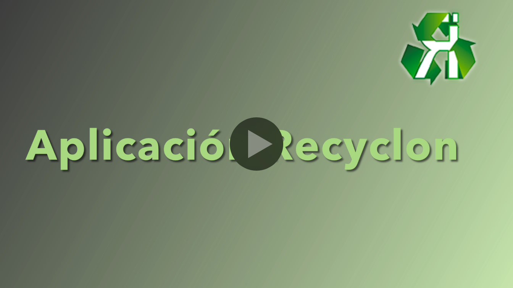
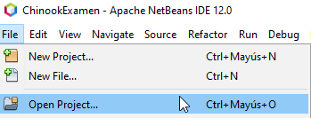
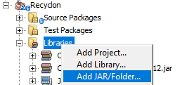
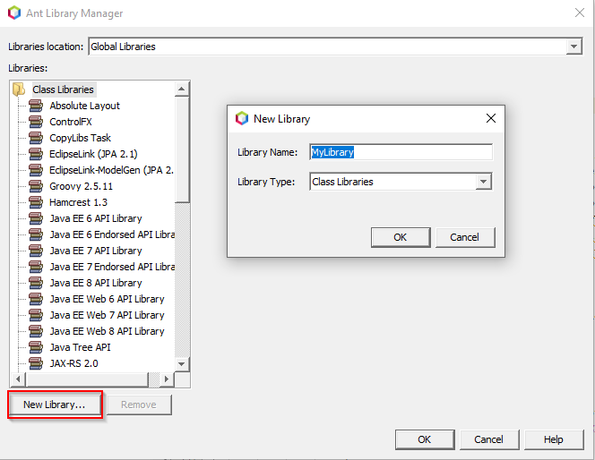

## Proyecto Recyclon

Este es un proyecto que se ha desarrollado en el centro [Colegio Zabalburu Ikastetxea](https://zabalburu.hezkuntza.net/es/inicio) durante la última evaluación del primer año del Ciclo Formativo de Grado Superior de Desarrollo de Aplicaciones Web (2020-2021). 

### ¿En qué consiste el proyecto?

El proyecto ha consistido en desarrollar una aplicación para la gestión de tesorería que será utilizada por parte del alumnado de segundo curso del Ciclo Formativo de Grado Superior de Administración y Finanzas. 

Durante el curso los alumnos trabajan sobre una empresa simulada (**Recyclon**). Esta empresa simulada intenta ser lo más realista posible, por una parte interactuando con otros centros para que cada uno ejerza diferentes roles (proveedor y/o cliente) y por otra parte creando diferentes equipos de trabajo que representarán algunos de los departamentos con los que cuenta una empresa. 

* Contabilidad.

* Facturación.
* Comercial.

Hasta el momento para llevar a cabo una correcta administración han estado utilizando el software gratuito que proporciona [DELSOL](https://www.sdelsol.com/), que incluye aplicaciones como **ContaSOL**, **NominaSOL** o **FactuSOL**. El equipo de trabajo que se encarga de la contabilidad tiene una necesidad que no queda cubierta por parte de ContaSOL, que es la gestión de la tesorería de la empresa. Para esta tarea se ha estado utilizando una hoja de cálculo en [Google Sheets](https://www.google.com/sheets/about/), a pesar de ser una herramienta muy potente no es suficiente para cubrir la necesidad que tiene el departamento de contabilidad.

Por este motivo se nos ha propuesto a los alumnos de DAW este reto. Ha sido una oportunidad para aplicar los conocimientos adquiridos durante el primer curso, además de ampliarlos a base de resolver los problemas que nos hemos encontrado durante todo el desarrollo.

### Aspectos técnicos

#### Asignaturas involucradas en el proyecto

El proyecto se ha desarrollado conjuntamente entre varias asignaturas. Además de programar la aplicación, también se han desarrollado otras tareas como la **gestión de la base de datos**, la **[documentación de la aplicación](https://zabalrecyclon.duckdns.org)** o la publicación de la documentación en un **[servidor web](https://github.com/tzinm/foro-post/blob/main/hard2mano/Servicios-self-hosted-en-un-VPS.md)**. Las asignaturas que han formado parte del proyecto han sido:

* **PRO** - Programación.
* **BBDD** - Bases de Datos.
* **LM** - Lenguaje de Marcas.
* **SI** - Sistemas Informáticos.

#### Herramientas utilizadas

En este apartado se nombran únicamente las herramientas utilizadas para el desarrollo de la aplicación.

* Lenguaje de programación [Java](https://es.m.wikipedia.org/wiki/Java_(lenguaje_de_programaci%C3%B3n)).
* [Framework JavaFX](https://openjfx.io/) para el desarrollo de la interfaz gráfica.
* [Scene Builder](https://gluonhq.com/products/scene-builder/) para el diseño de la interfaz gráfica.
* [Apache NetBeans](https://netbeans.apache.org/) como IDE (Integrated Development Environment o Entorno de Desarrollo Integrado).
* [Oracle Database](https://es.m.wikipedia.org/wiki/Oracle_Database) como sistema de gestión de base de datos.

### Requisitos de la aplicación

Basándonos en la información proporcionada por los responsables del Ciclo Formativo de AF, la aplicación se ha estructurado del siguiente modo:

#### Tablas estáticas

* **Bancos**: esta tabla contiene los bancos con los que se trabaja, tanto para pagos como para cobros. Esta tabla permite realizar las siguientes acciones:
  * **Dar de alta** un nuevo banco.
  * **Modificar** un banco que se encuentre en la base de datos.
  * **Eliminar** un banco que se encuentre en la base de datos.
* **Proveedores**: esta tabla contiene los proveedores que se encargan de suministrar las diferentes compras a la empresa. Esta tabla permite realizar las siguientes acciones:
  * **Dar de alta** un nuevo proveedor.
  * **Modificar** un proveedor que se encuentre en la base de datos.
  * **Eliminar** un proveedor que se encuentre en la base de datos, siempre y cuando no tenga pagos asociados (más adelante veremos qué son los pagos).
* **Clientes**: esta tabla contiene los clientes a los que la empresa vende sus productos. Esta tabla permite realizar las siguientes acciones:
  * **Dar de alta** un nuevo cliente, nombre y número de cuenta (este último dato es opcional).
  * **Modificar** un cliente que se encuentre en la base de datos.
  * **Eliminar** un cliente que se encuentre en la base de datos, siempre y cuando no tenga cobros asociados (más adelante veremos qué son los cobros).

#### Tablas dinámicas

* **Pagos**: esta tabla contiene los datos relacionados con los pagos, tanto pendientes como ya emitidos. Esta tabla permite realizar las siguientes acciones:
  * **Filtrar** los pagos, con la posibilidad de concatenar diferentes filtros. Los filtros permitidos son los siguientes:
    * Nombre de proveedor.
    * Rango de fechas en base a la fecha de vencimiento. Dos campos, fecha "desde" y fecha "hasta".
    * Banco desde donde se emitirá el pago.
    * Estado del pago (pendiente o realizado).
  * **Dar de alta** un nuevo pago.
  * **Modificar** un pago que se encuentre en la base de datos.
  * **Eliminar** un pago que se encuentre en la base de datos.
* **Cobros**: esta tabla contiene los datos relacionado con los cobros, tanto pendientes como ya recibidos. Esta tabla permite realizar la siguientes acciones:
  * **Filtrar** los cobros, con la posibilidad de concatenar diferentes filtros. Los filtros permitidos son los siguientes:
    * Nombre de cliente.
    * Rango de fechas en base a la fecha de vencimiento. Dos campos, fecha "desde" y fecha "hasta".
    * Banco donde se recibirá el cobro.
    * Estado del cobro (pendiente o recibido).

A pesar de diferenciar en los aspectos técnicos dos bloques (tablas estáticas y dinámicas), en todos los casos los datos que se visualizan en las tablas se mantienen **sincronizados** con la base de datos. El elemento de JavaFX utilizado para mostrar las diferentes tablas ha sido un [TableView](https://docs.oracle.com/javase/8/javafx/api/javafx/scene/control/TableView.html) junto a un modelo de datos observable (interfaz [ObservableList](https://docs.oracle.com/javase/8/javafx/api/javafx/collections/ObservableList.html)) para que los datos se mantengan actualizados.

Esta es la base que nos ha permitido comenzar con el desarrollo de la aplicación. No obstante, lo hemos complementado con una serie de mejoras que se podrán ver en el vídeo de muestra del funcionamiento de la aplicación:

* Filtros de búsqueda.
* Aspecto visual mejorado.
* Exportar a CSV.

### Probando la aplicación

[](https://youtu.be/ak4CLZUZyiI)

Para poder hacer uso de la aplicación es necesario descargarse el contenido que se encuentra bajo el directorio **recyclon**. En este directorio se encuentra todo el código de la aplicación, el código desarrollado en el IDE Apache NetBeans. Además de esto, es importante tener en cuenta lo siguiente:

1. Dependencias de la aplicación.

   * [ControlFX](https://controlsfx.github.io/) -> esta librería se ha utilizado para el autocompletado del texto.

   * [JDBC](https://www.oracle.com/es/database/technologies/appdev/jdbc-downloads.html) -> esta librería se ha utilizado para la conexión con la base de datos.

2. Contenido de la base de datos.  En este caso se proporciona dos ficheros **.sql** que son suficientes para poner a prueba la aplicación.

   * Un fichero para la creación de las diferentes tablas.
   * Un fichero para la inserción de datos en las tablas y que la aplicación muestre contenido.

Una vez que se haya descargado todo el contenido bajo el directorio Recyclon (contiene el proyecto completo) podemos abrirlo desde Apache NetBeans tal y como vemos en la siguiente captura.




Una vez que hemos cargado el proyecto en nuestro IDE debemos llevar a cabo una serie de acciones para adecuarlo a nuestro entorno.

1. Necesitamos añadir los dos ficheros **JAR** (ControlFX y JDBC) descargados de los enlaces que se encuentran más arriba. Podemos añadirlos al proyecto de dos formas diferentes:

   1. Como un fichero JAR desde el propio proyecto:

      

   2. Como una librería global que se añade desde **Tools** > **Libraries** > **New Library...**:

   

2. Además del proceso que acabamos de ver es necesario hacer un cambio en el código fuente de la aplicación. La clase `Conexion` que se encuentra en el paquete **net.zabalburu.recyclon.util** tiene la información sobre la conexión a la base de datos.

   Las líneas que tienen un comentario son las que pueden necesitar ser modificadas para que la conexión a la base de datos funcione correctamente.

```java
public static Connection getConexion() {
    if (cnn == null) {
        try {
            OracleDataSource ds = new OracleDataSource();
            ds.setDriverType("thin");
            ds.setServerName("localhost");		//Dirección IP o nombre donde se encuentra el servidor
            ds.setPortNumber(1521);				//Puerto para la conexión
            ds.setDatabaseName("ORCL");
            ds.setUser("programacion");			//Usuario de la base de datos
            ds.setPassword("tiger");			//Contraseña de acceso del usuario 'programacion'
            cnn = ds.getConnection();
        } catch (SQLException ex) {
            Logger.getLogger(Conexion.class.getName()).log(Level.SEVERE, null, ex);
        }
    }
    return cnn;
}
```

### Comentarios adicionales

Es importante tener en cuenta que la aplicación ha sido desarrollada por alumnos ([@manurivasf](https://github.com/manurivasf) y [@tzinm](https://github.com/tzinm) durante el primer año de DAW. Es probable que la aplicación presente:

* Bugs no predecibles.
* Incoherencia en algunas partes del código debido a la fusión de código desarrollado por diferentes programadores.
* Lo que se considera como *buenas prácticas* a la hora de programar en Java.

En cualquier caso, cualquier usuario puede contactar con cualquiera de los dos desarrolladores a través del correo electrónico público que se muestra en el perfil de GitHub.
